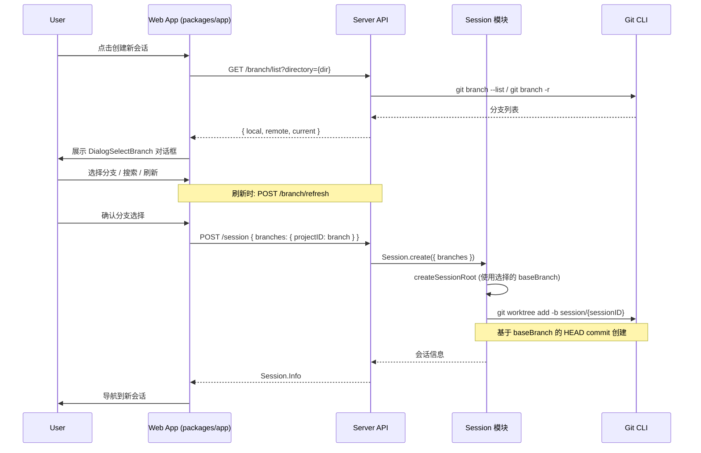

# 设计文档：Session Branch Selector

## 概述

本功能在会话（Session）创建流程中增加分支选择步骤。当用户在 Web 端创建新会话时，系统为工作区中每个 git 类型的项目展示分支选择对话框，用户可以选择基础分支（Base Branch），系统基于该分支的 HEAD commit 创建带有 `session/{sessionID}` 格式的 worktree 分支。

当前 `Session.createSessionRoot` 函数自动使用 `userWorktreeDirectory` 的当前 HEAD 分支作为 baseBranch。本功能将该行为改为：在创建会话前，通过 Web UI 对话框收集用户对每个 git 项目的分支选择，然后将选择结果通过 API 传递给 worktree 创建流程。

本功能仅在 Web 端（`packages/app`）实现，不涉及 TUI 或 CLI 的改动。

### 核心变更点

1. **后端 - Session 创建流程**：在 `createNext` / `createSessionRoot` 中接受外部传入的 `baseBranch` 参数
2. **后端 - 分支列表 API**：新增 API 端点，提供获取本地+远程分支列表的能力（含 `git fetch`）
3. **后端 - Server API**：扩展 session create 请求体，支持传入分支选择
4. **前端 - 分支选择对话框**：在 `packages/app` 中新增 `DialogSelectBranch` 组件，参考现有 `DialogSelectProject` 模式
5. **前端 - 会话创建流程**：在 `layout.tsx` 的 `createSession` 中集成分支选择步骤
6. **SDK 重新生成**：更新 SDK 以包含新的 API 端点和请求体变更

## 架构



## 组件与接口

### 1. Branch 模块 (`packages/opencode/src/branch/index.ts`)

新增模块，封装分支列表获取、搜索过滤、分支名校验等逻辑。

```typescript
export namespace Branch {
  // 获取指定目录的本地和远程分支列表
  export async function list(directory: string): Promise<{
    local: string[]
    remote: string[]
    current: string | undefined
  }>

  // 执行 git fetch 后重新获取分支列表
  export async function refresh(directory: string): Promise<{
    local: string[]
    remote: string[]
    current: string | undefined
  }>

  // 模糊匹配过滤分支
  export function filter(branches: string[], query: string): string[]

  // 校验分支名是否合法（git check-ref-format）
  export async function validate(name: string, directory: string): Promise<boolean>

  // 检查分支名是否已存在
  export async function exists(name: string, directory: string): Promise<boolean>
}
```

### 2. Branch Server Routes (`packages/opencode/src/server/routes/branch.ts`)

新增 API 路由，供 Web 前端调用：

```typescript
// GET /branch/list?directory={dir}
// 返回 { local: string[], remote: string[], current?: string }

// POST /branch/refresh { directory: string }
// 执行 git fetch 后返回更新的分支列表
```

### 3. Session 模块变更 (`packages/opencode/src/session/index.ts`)

修改 `createNext` 和 `createSessionRoot`，接受可选的 `baseBranch` 映射。

```typescript
// createNext 新增参数
async function createNext(input: {
  id?: string
  title?: string
  parentID?: string
  directory: string
  permission?: PermissionNext.Ruleset
  userID?: string
  branches?: Record<string, string> // projectID -> baseBranch
})

// createSessionRoot 新增参数
async function createSessionRoot(input: {
  workspaceProject: Workspace.ProjectInfo
  sessionID: string
  sessionDirectory: string
  baseBranch?: string // 用户选择的基础分支
})
```

当 `baseBranch` 参数存在时，`createSessionRoot` 使用该分支的 HEAD commit 而非 `userWorktreeDirectory` 的当前 HEAD：

```typescript
// 在 createSessionRoot 中
const base = input.baseBranch ?? (await gitText(userWorktreeDirectory, ["rev-parse", "--abbrev-ref", "HEAD"]))
const commit = await gitText(userWorktreeDirectory, ["rev-parse", base])
// git worktree add --no-checkout -b session/{sessionID} {dir} {commit}
```

### 4. Session Server Route 变更 (`packages/opencode/src/server/routes/session.ts`)

扩展 session create 的请求体 schema，支持传入分支选择：

```typescript
Session.create.schema = z.object({
  // ...existing fields
  branches: z.record(z.string(), z.string()).optional(), // projectID -> baseBranch
})
```

### 5. Web 前端 - DialogSelectBranch 组件 (`packages/app/src/components/dialog-select-branch.tsx`)

新增对话框组件，参考现有 `DialogSelectProject` 和 `DialogFork` 的模式：

- 使用 `Dialog` + `List` 组件展示分支列表
- 分支按 "本地" / "远程" 分类展示
- 支持搜索过滤（利用 `List` 组件的 `search` prop 或自定义 `fuzzysort` 过滤）
- 默认选中当前分支
- 提供刷新按钮，调用 `POST /branch/refresh` 后更新列表
- 分支名冲突时展示文本输入框让用户手动输入

```typescript
interface DialogSelectBranchProps {
  directory: string
  projectName: string
  onSelect: (branch: string | null) => void
}
```

### 6. Web 前端 - 会话创建流程变更 (`packages/app/src/pages/layout.tsx`)

在 `createSession` 函数中，创建会话前先弹出分支选择对话框：

1. 获取 workspace 的 projects 列表
2. 对每个 vcs="git" 的 project，弹出 `DialogSelectBranch`
3. 收集所有分支选择结果
4. 将 `branches` 参数传入 `session.create({ branches })`

### 7. SDK 更新

运行 `./packages/sdk/js/script/build.ts` 重新生成 SDK，使前端能使用新增的 `branches` 字段和 branch API。

## 数据模型

### 现有数据模型（无需修改 schema）

`Workspace.SessionRoot` 已包含 `baseBranch` 和 `baseCommit` 字段：

```typescript
export const SessionRoot = z.object({
  projectID: z.string(),
  slug: z.string(),
  sourceDirectory: z.string(),
  name: z.string().optional(),
  description: z.string().optional(),
  userWorktreeDirectory: z.string(),
  sessionWorktreeDirectory: z.string(),
  primary: z.boolean().optional(),
  vcs: z.literal("git").optional(),
  branch: z.string().optional(), // session/{sessionID}
  baseBranch: z.string().optional(), // 用户选择的基础分支
  baseCommit: z.string().optional(), // 基础分支的 HEAD commit
  headCommit: z.string().optional(),
})
```

### 分支列表 API 响应

```typescript
// GET /branch/list 返回值
{
  local: string[]      // 本地分支名列表，如 ["main", "dev", "feature/foo"]
  remote: string[]     // 远程分支名列表（去除 origin/ 前缀），如 ["main", "dev"]
  current: string | undefined  // 当前所在分支
}
```

### Session.create 输入扩展

```typescript
// 新增 branches 字段
{
  parentID?: string
  title?: string
  permission?: PermissionNext.Ruleset
  workspaceID?: string
  branches?: Record<string, string>  // projectID -> 用户选择的 baseBranch
}
```

## 正确性属性（Correctness Properties）

_属性（Property）是指在系统所有合法执行中都应成立的特征或行为——本质上是对系统应做什么的形式化陈述。属性是人类可读规范与机器可验证正确性保证之间的桥梁。_

### Property 1: Git 项目过滤

_For any_ workspace 包含任意数量的 projects（混合 vcs="git" 和非 git 项目），分支选择流程应仅对 vcs="git" 的项目触发，且触发次数等于 git 项目的数量。非 git 项目应被完全跳过。

**Validates: Requirements 1.1, 1.3**

### Property 2: 默认分支选中

_For any_ git 项目及其当前分支，分支选择器的默认选中值应等于该项目的当前分支名。

**Validates: Requirements 1.2**

### Property 3: 分支搜索过滤

_For any_ 分支名列表和任意搜索关键词，过滤后的结果应仅包含名称中包含该关键词（大小写不敏感）的分支，且结果集是原列表的子集。

**Validates: Requirements 3.2**

### Property 4: Worktree 分支名格式

_For any_ sessionID，创建的 worktree 分支名应严格等于 `session/{sessionID}`。

**Validates: Requirements 4.1**

### Property 5: BaseBranch 记录一致性

_For any_ 用户选择的 baseBranch 和创建的 SessionRoot，SessionRoot.baseBranch 字段应等于用户选择的分支名，且 SessionRoot.baseCommit 应等于该分支在创建时的 HEAD commit。

**Validates: Requirements 1.4, 4.3, 4.4**

### Property 6: 分支名校验

_For any_ 字符串作为分支名输入，`validate` 函数的返回值应与 `git check-ref-format --branch` 的结果一致。

**Validates: Requirements 5.5**

## 错误处理

### 分支列表获取失败

- 当 `git branch` 命令执行失败时（exitCode !== 0），返回空列表并通过日志记录错误
- 当 `git fetch` 失败时，仍然返回本地已有的分支列表，不阻塞用户操作
- 符合项目风格：不使用 try/catch，使用 `.nothrow()` + exitCode 检查
- Web 前端在 API 调用失败时保留上一次的分支列表数据

### 分支名冲突

- 自动生成的 `session/{sessionID}` 分支名冲突时（极低概率），Web 对话框展示文本输入框让用户手动输入
- 用户输入的分支名通过 `git check-ref-format` 校验合法性
- 用户输入的分支名通过 `git show-ref` 检查是否已存在
- 校验失败时在对话框中提示用户重新输入

### Worktree 创建失败

- 沿用现有 `createSessionRoot` 的错误处理模式：读取 stderr/stdout 并抛出 Error
- 分支不存在时（如远程分支未同步），提示用户先执行刷新操作

### 非 Git 项目

- vcs 不是 "git" 的项目直接跳过分支选择，不展示任何 UI
- 与现有 `createSessionRoot` 中的非 git 处理逻辑保持一致

## 测试策略

### 单元测试

使用 Bun 内置测试框架（`bun:test`），聚焦以下场景：

- **Branch.filter**：特定搜索词的过滤结果验证
- **Branch.validate**：已知合法/非法分支名的校验结果
- **Branch.exists**：已知存在/不存在分支的检测结果
- **createSessionRoot 集成**：传入 baseBranch 参数后 SessionRoot 字段的正确性

边界情况：

- 空分支列表
- 搜索关键词为空字符串
- 分支名包含特殊字符（`/`, `..`, 空格等）
- workspace 中所有项目都不是 git 类型

### 属性测试（Property-Based Testing）

使用 [fast-check](https://github.com/dubzzz/fast-check) 库进行属性测试。

配置要求：

- 每个属性测试至少运行 100 次迭代
- 每个测试通过注释标注对应的设计属性

标注格式：`Feature: session-branch-selector, Property {number}: {property_text}`

属性测试覆盖：

1. **Property 1 测试**：生成随机 workspace projects（混合 vcs 类型），验证过滤逻辑仅选出 git 项目
   - `// Feature: session-branch-selector, Property 1: Git 项目过滤`

2. **Property 3 测试**：生成随机分支名列表和搜索词，验证过滤结果的正确性（子集关系 + 匹配关系）
   - `// Feature: session-branch-selector, Property 3: 分支搜索过滤`

3. **Property 4 测试**：生成随机 sessionID 字符串，验证分支名格式为 `session/{sessionID}`
   - `// Feature: session-branch-selector, Property 4: Worktree 分支名格式`

4. **Property 6 测试**：生成随机字符串，验证分支名校验函数的正确性
   - `// Feature: session-branch-selector, Property 6: 分支名校验`

### 集成测试

- Property 2（默认分支选中）和 Property 5（BaseBranch 记录一致性）涉及 git 仓库状态，通过集成测试（单元测试 + 实际 git 操作）覆盖
- Web 前端 DialogSelectBranch 组件通过 Playwright e2e 测试覆盖

### 测试互补性

- 单元测试负责具体示例、边界情况和集成点验证
- 属性测试负责通用规则在大量随机输入下的正确性验证
- e2e 测试负责 Web 前端交互流程的端到端验证
